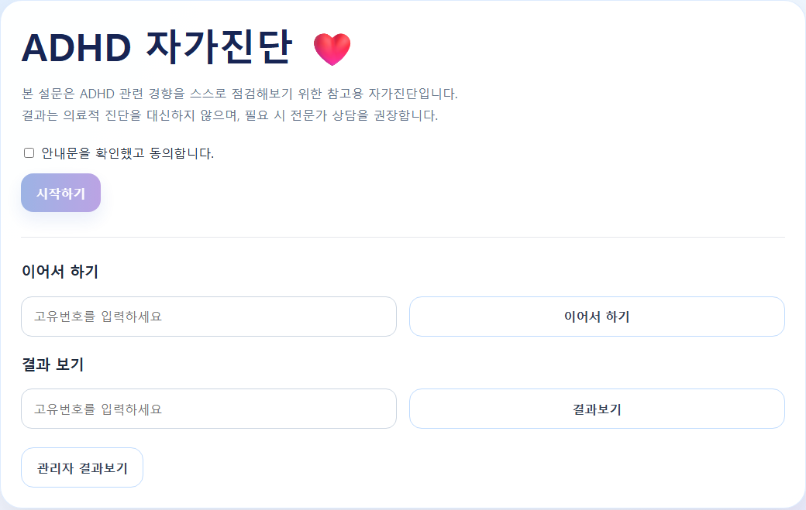
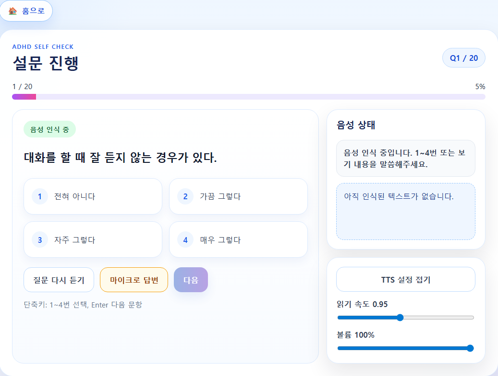
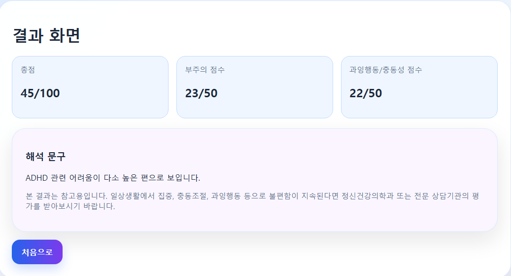

# 🔊 음성 기반 ADHD 자가진단 설문 시스템

> **TTS/STT 기반 음성 인터랙션 웹 시스템**  
> 사용자 음성 입력과 음성 안내를 활용한 Human-Machine Interaction 프로젝트

---

## 📌 프로젝트 소개

TTS (**Text-to-Speech**)와 STT (**Speech-to-Text**)를 활용하여  
사용자가 **음성으로 설문을 진행할 수 있는 인터랙티브 웹 시스템**입니다.

기존 텍스트 기반 설문의 접근성을 개선하고,  
보다 자연스러운 **사용자-시스템 상호작용 (Human-Machine Interaction)** 을 구현하는 것을 목표로 개발했습니다.

---

## 🖼 프로젝트 화면

### 🏠 메인 화면


### 📝 설문 진행 화면


### 📊 결과 화면


### 👨‍💼 관리자 화면


---

## 🛠 기술 스택

### 🎨 Frontend
- SvelteKit
- JavaScript
- HTML / CSS

### ⚙️ Backend
- FastAPI
- Python
- Pydantic

### 🎙 음성 처리
- STT (Speech-to-Text)
- TTS (Text-to-Speech)

### 💾 데이터 저장
- CSV
- JSON

### 🔧 기타
- Git
- GitHub
- REST API

---

## 🏗 시스템 구조

```text
👤 사용자
   ↓
🖥 Frontend (SvelteKit)
   ↓ REST API
⚙️ Backend (FastAPI)
   ├── User Service
   ├── Survey Service
   ├── Result Service
   ├── Score Service
   └── Admin Service
   ↓
💾 CSV / JSON 저장

🎙 Voice Layer
   ├── TTS
   └── STT
```

---

## ✨ 주요 기능

✅ TTS 음성 질문 안내  
✅ STT 음성 응답 인식  
✅ 음성 인식 실패 시 수동 선택 fallback  
✅ 설문 진행 상태 저장 및 복구  
✅ ADHD 점수 계산  
✅ 응답 리뷰 및 수정 기능  
✅ 관리자 통계 조회  
✅ 프론트엔드 / 백엔드 API 분리 구조  

---

## 🔥 기술적 문제 해결

### 1️⃣ TTS 재생 중 사용자 수동 입력 충돌 문제

#### ❗ 문제
사용자가 수동으로 답변을 선택했는데도 기존 TTS 음성이 계속 재생되어  
사용자 경험(UX)이 저하되는 문제가 발생했습니다.

#### ✅ 해결
사용자 입력 이벤트 발생 시  
진행 중인 음성(TTS) 이벤트를 즉시 중단하도록 **상태 제어 로직**을 구현했습니다.

---

### 2️⃣ 음성 인식 실패 대응

#### ❗ 문제
마이크 권한 거부, 무응답, 음성 인식 오류 등으로 인해  
설문 진행이 중단될 수 있었습니다.

#### ✅ 해결
수동 선택 UI를 **fallback 방식**으로 제공하여  
설문이 중단되지 않도록 구현했습니다.

---

### 3️⃣ 설문 진행 상태 유실 문제

#### ❗ 문제
페이지 새로고침 또는 브라우저 이탈 시  
사용자의 진행 상태가 사라질 수 있었습니다.

#### ✅ 해결
JSON 기반 **draft 저장 기능**을 구현하여  
재진입 시 이어서 설문을 진행할 수 있도록 구성했습니다.

---

## 👨‍💻 담당 역할

- FastAPI 기반 REST API 설계 및 구현
- 설문 응답 처리 로직 개발
- ADHD 점수 계산 로직 구현
- STT / TTS 음성 인터랙션 기능 구현
- 프론트엔드 / 백엔드 API 연동
- 관리자 통계 기능 구현
- 사용자 경험 개선을 위한 상태 제어 로직 구현

---

## 🚀 실행 방법

### ⚙️ Backend 실행

```bash
cd backend
pip install -r requirements.txt
uvicorn main:app --reload
```

### 🖥 Frontend 실행

```bash
cd frontend
npm install
npm run dev
```

---

## 🎯 프로젝트 의의

이 프로젝트는 단순 설문 웹서비스가 아니라,

🔹 음성 인터페이스 기반 사용자 상호작용  
🔹 실시간 이벤트 처리  
🔹 사용자 상태 관리  
🔹 API 기반 시스템 설계  

경험을 담은 프로젝트입니다.

특히 **로봇 / 휴머노이드 소프트웨어 분야의 Human-Machine Interaction 관점**과 연결될 수 있도록 설계했습니다.

---

## 🤖 키워드

`FastAPI` `SvelteKit` `STT` `TTS` `REST API` `Voice Interface` `Human-Machine Interaction` `State Management`
